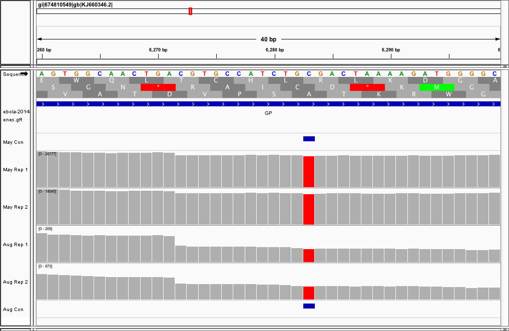

```{r, include=F, echo=F}
library(readr)
```

# Comparative Ebola Genomics

This report connects the homework for units 7, 8, 9, and 10. I'll be looking to recreate a small piece of the analysis done in Gire et al. 2014 where I look at ebola isolates sampled at different time points during 2014 to see if I can differentiate them by their variant calls. I included two biological replicates per timepoint that were collected on the same day. It should be noted that while the June and August samples were sequenced on April of 2015 the May samples were sequenced August of 2014. Normally this could lead to potential batch effects but since we're looking at whole genome sequencing samples that may not be the case. The ebola genome is made of RNA, not DNA, so my assumption may be wrong.

Collection Dates and Accessions:

* May 28th    - `SRR1553468` & `SRR1553464`
* June 28th   - `SRR1972602` & `SRR1972603`
* August 30th - `SRR1972861` & `SRR1972852`

That information can be found [here](http://www.ncbi.nlm.nih.gov/Traces/study/?acc=SRP045416).

The reference genome I'll be comparing these samples to is the assembly in Figure 4 of Gire et al. 2014, the Kissidougou Guinean sequence (accesion KJ660346).

Here I'll attempt to annotate those variants using bedtools and understand the effect those variants may have, if any, on viral proteins.

## Variant Annotation

In order to annotate those SNP calls I decided to utilize a simple approach and see in which region the SNPs fell. That is, whether they intersected with genomic intervals or intergenic regions of the genome.

In order to create an interval file that bedtools likes to work with I had to first download the GenBank file and convert it to GFF3 using Seqret of the EMBOSS suite.

```{r, eval=F, engine="bash"}
$ efetch -db nucleotide -id KM034562 -format gb > ebola-2014.gb
```

I converted the VCF file to bed using the following command:

```{r, eval=F, engine="bash"}
$ awk '! /\#/' results.vcf | awk '{if(length($4) > length($5)) print $1"\t"($2-1)"\t"($2+length($4)-1); else print $1"\t"($2-1)"\t"($2+length($5)-1)}' > variants.bed
```

And then used the following bedtools command to investigate where those variants overlapped with open reading frames and which ones:

```{r, eval=F, engine="bash"}
bedtools intersect -a ebola-2014-genes.gff -b consensus_variants.bed -wb
```

For May I get:

```
KJ660346        EMBL    gene    799     800     .       +       .       ID=KJ660346.4;gene=NP   KJ660346        799     800
KJ660346        EMBL    gene    1848    1849    .       +       .       ID=KJ660346.4;gene=NP   KJ660346        1848    1849
KJ660346        EMBL    gene    6282    6283    .       +       .       ID=KJ660346.19;gene=GP  KJ660346        6282    6283
KJ660346        EMBL    gene    11810   11811   .       +       .       ID=KJ660346.44;gene=L   KJ660346        11810   11811
KJ660346        EMBL    gene    15598   15599   .       +       .       ID=KJ660346.44;gene=L   KJ660346        15598   15599
KJ660346        EMBL    gene    15962   15963   .       +       .       ID=KJ660346.44;gene=L   KJ660346        15962   15963
```

And for August I get:

```
KJ660346        EMBL    gene    799     800     .       +       .       ID=KJ660346.4;gene=NP   KJ660346        799     800
KJ660346        EMBL    gene    1848    1849    .       +       .       ID=KJ660346.4;gene=NP   KJ660346        1848    1849
KJ660346        EMBL    gene    3175    3176    .       +       .       ID=KJ660346.9;gene=VP35 KJ660346        3175    3176
KJ660346        EMBL    gene    6282    6283    .       +       .       ID=KJ660346.19;gene=GP  KJ660346        6282    6283
KJ660346        EMBL    gene    7147    7148    .       +       .       ID=KJ660346.19;gene=GP  KJ660346        7147    7148
KJ660346        EMBL    gene    7233    7234    .       +       .       ID=KJ660346.19;gene=GP  KJ660346        7233    7234
KJ660346        EMBL    gene    8927    8928    .       +       .       ID=KJ660346.33;gene=VP30        KJ660346        8927    8928
KJ660346        EMBL    gene    10217   10218   .       +       .       ID=KJ660346.39;gene=VP24;note=putative  KJ660346        10217   10218
KJ660346        EMBL    gene    12632   12633   .       +       .       ID=KJ660346.44;gene=L   KJ660346        12632   12633
KJ660346        EMBL    gene    15962   15963   .       +       .       ID=KJ660346.44;gene=L   KJ660346        15962   15963
KJ660346        EMBL    gene    17141   17142   .       +       .       ID=KJ660346.44;gene=L   KJ660346        17141   17142
KJ660346        EMBL    gene    17444   17445   .       +       .       ID=KJ660346.44;gene=L   KJ660346        17444   17445
KJ660346        EMBL    gene    18161   18162   .       +       .       ID=KJ660346.44;gene=L   KJ660346        18161   18162
```

So we can see that for both timepoints we get a SNP overlapping every gene! Typically what one wants to do now is used a program such as SnpEff to annotate these variants but bedtools should work well enough for now.

## Biological Interpretation

Below is figure 4 from Gire et al.


Interesting enough we can see several SNPs that demarcate lineages over time. Position 10,218 is highlighted below as an important SNP that distinguishes SL3 from SL2 and SL1. Below is an IGV snapshot of the same variant found only in the August samples confirming that we are indeed looking at two different lineages.

This SNP overlaps a gene encoding for VP24 which is important for emitting an immune response by the hose ([source](http://www.uniprot.org/uniprot/Q05322)). If it does interact with parts of the host immne system, although it sounds like its interaction is indirect, then it would make sense that overtime a mutation became fixed within the population in order to continue to outsmart the host immune system as it tried it's best to alert the body of this foreign pathogen and evoke an immune response via cytokine activation.

Below we see a SNP that's been within the population the entire time and it intersects with the gene encoding Glycoprotein. Glycoprotein is a very important protein as it directly interacts with the host cell as it allows for host cell entry. This means it must be able to bind specifically to the receptors found outside of the host cell but at the same time continue to evade the immune system which will also be directly interacting with GP. 



If we look at [UniProt](http://www.uniprot.org/uniprot/Q05320) it makes note of the sites important for host cell receptor recognition. One is at amino acid 95 while another is at amino acid 170. However, the substitution in the snapshot above is not at either of those sites. Rather it sits at amino acid 127 and causes a nonsynonomous mutation. On the amino acide level it doesn't seem to be involved in the function of GP.