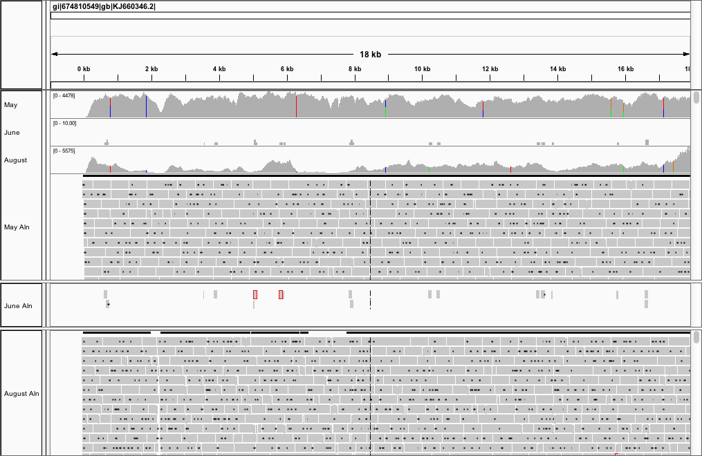
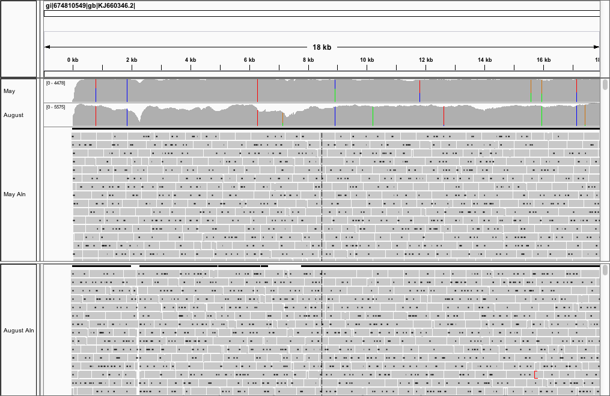
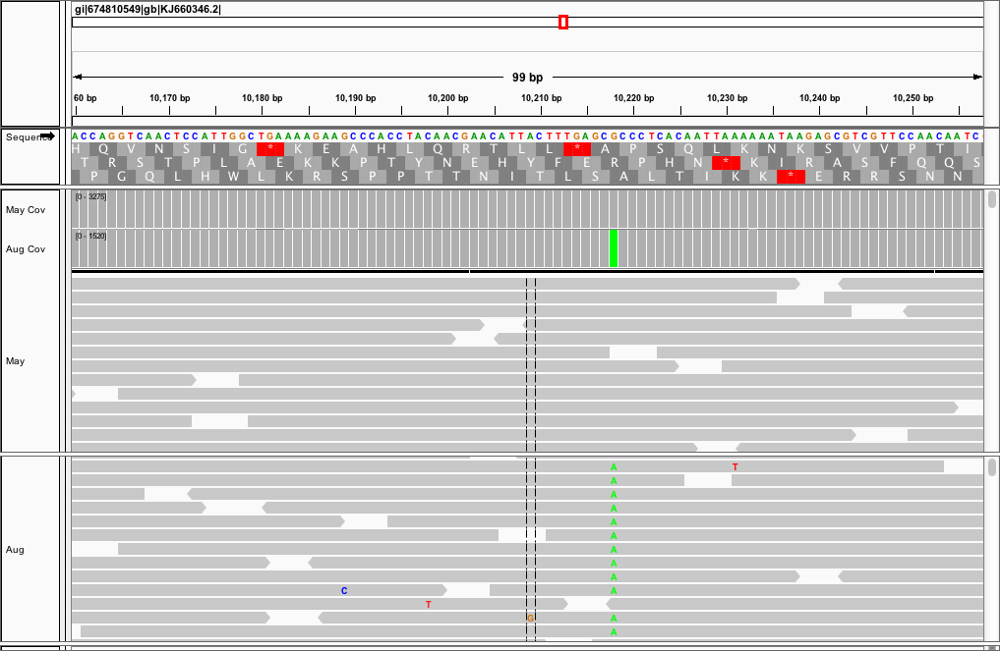
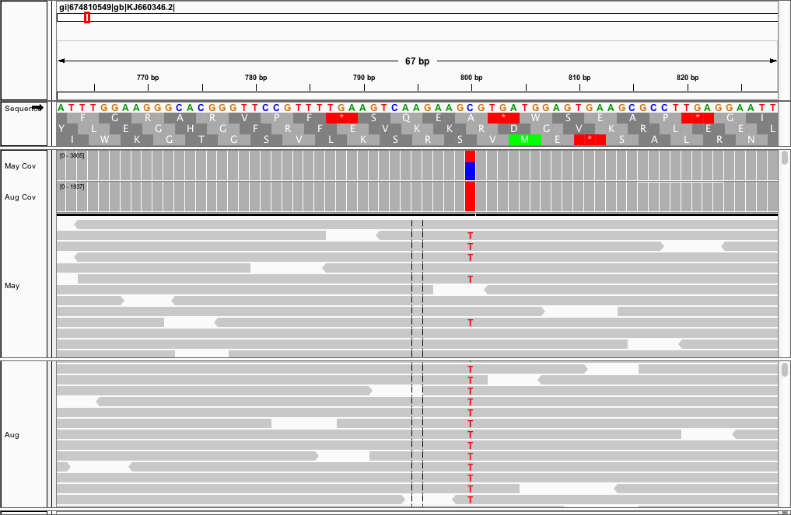

```{r, include=F, echo=F}
library(readr)
```

# Comparative Ebola Genomics

This report connects the homework for units 7, 8, 9, and 10. I'll be looking to recreate a small piece of the analysis done in Gire et al. 2014 where I look at ebola isolates sampled at different time points during 2014 to see if I can differentiate them by their variant calls. I included two biological replicates per timepoint that were collected on the same day. It should be noted that while the June and August samples were sequenced on April of 2015 the May samples were sequenced August of 2014. Normally this could lead to potential batch effects but since we're looking at whole genome sequencing samples that may not be the case. The ebola genome is made of RNA, not DNA, so my assumption may be wrong.

Collection Dates and Accessions:

* May 28th    - `SRR1553468` & `SRR1553464`
* June 28th   - `SRR1972602` & `SRR1972603`
* August 30th - `SRR1972861` & `SRR1972852`

That information can be found [here](http://www.ncbi.nlm.nih.gov/Traces/study/?acc=SRP045416).

The reference genome I'll be comparing these samples to is the assembly in Figure 4 of Gire et al. 2014, the Kissidougou Guinean sequence (accesion KJ660346).

Here I'll try to the visualize the alignment in IGV and comment on what I see.

## Alignment Review

The following were the alignment statistics I got from the samples I aligned in homework 7 this time concatenated into a single bam file.

#### May

```{r, quote=""}
aln_stats <- read_file("data-bwa/may/aln.stats")
cat(aln_stats)
```

#### July

```{r, quote=""}
aln_stats <- read_file("data-bwa/jun/aln.stats")
cat(aln_stats)
```

#### August

```{r, quote=""}
aln_stats <- read_file("data-bwa/aug/aln.stats")
cat(aln_stats)
```

Now I want to visualize some of these alignments.

## Alignment Visualization

From a first glance it's easy to note the differences in coverage between the samples. In fact, the may samples contained so many reads that it was cumbersome to visualize all of them at once so I used samtools to randomly sample 10% of the bam file to make it easier to visualize. Assuming that sequencing went smoothly and the genome coverage was mostly uniform this shouldn't be a problem. Any variants that are present should still stand out.

**Whole Genome View**

IGV has a lot of of great features that make it ideal for getting up close and personal with your alignment.

Here is a visualization of the entire genome for all three samples.



What you can see is the incredibly low number of reads that mapped for my June sample. As a result I removed it from subsequent visualizations because there really wasn't anything to see. It just took up space.



In order to visualize the variants a little more clearly I log transformed the coverage values as you see above. Now I can see from a whole genome view which variants are shared, which aren't, and what looks to be variants that have changed over time with respect to the viral population that's been sequenced.


Here we see an example of a shared variant between both samples. It's present in practically 100% of the reads for both time points.



Here we see an example of a nonshared variant. Here over time it looks like the virus has adopted a new mutation into it's genome on a population wide scale. Evolution has apparently selected for this mutation for whatever reason.



This is one of the most interested observations and we see this multiple times actually. We can see that within the May samples there is a shared genotype within the population for certain positions. But then when we move to the August samples the alternative base within the population has taken over. This again indicates that evolution has designated that this SNP gives the virus some kind of advantage over viruses that don't contain that mutation


## Digging into the Alignment Files

Based on the lectures I was interested in the strand bias issue that came up and was able to discover the following: 

```{r, eval=F, engine="bash"}
$ for month in may jun aug; do echo -e "Month: $month\n"; rev=$(samtools view -c -f 16 $month/aln.bam); for=$(samtools view -c -F 16 $month/aln.bam);echo -e "Forward: $for\nReverse: $rev"; fraction=$(echo "$for/$rev" | bc -l); echo -e "Ratio: $fraction\n"; done
```

```
Month: may

Forward: 4753514
Reverse: 2928708
Ratio: 1.62307543121403704295

Month: jun

Forward: 2461387
Reverse: 7
Ratio: 351626.71428571428571428571

Month: aug

Forward: 1121794
Reverse: 151555
Ratio: 7.40189370195638547062
```

After filtering out unmapped reads:

```{r, eval=F, engine="bash"}
$ for month in may jun aug; do echo -e "Month: $month\n"; rev=$(samtools view -c -F 4 -f 16 $month/aln.bam); for=$(samtools view -c -F 4 -F 16 $month/aln.bam);echo -e "Forward: $for\nReverse: $rev"; fraction=$(echo "$for/$rev" | bc -l); echo -e "Ratio: $fraction\n"; done
```

```
Month: may

Forward: 3769942
Reverse: 2928672
Ratio: 1.28725306213874411337

Month: jun

Forward: 15
Reverse: 7
Ratio: 2.14285714285714285714

Month: aug

Forward: 167658
Reverse: 151332
Ratio: 1.10788200777099357703
```

So it looks like the bias mostly disappears if you filter out unmapped reads? I simply wanted to keep reads that were mapped to the forward and reverse strands.