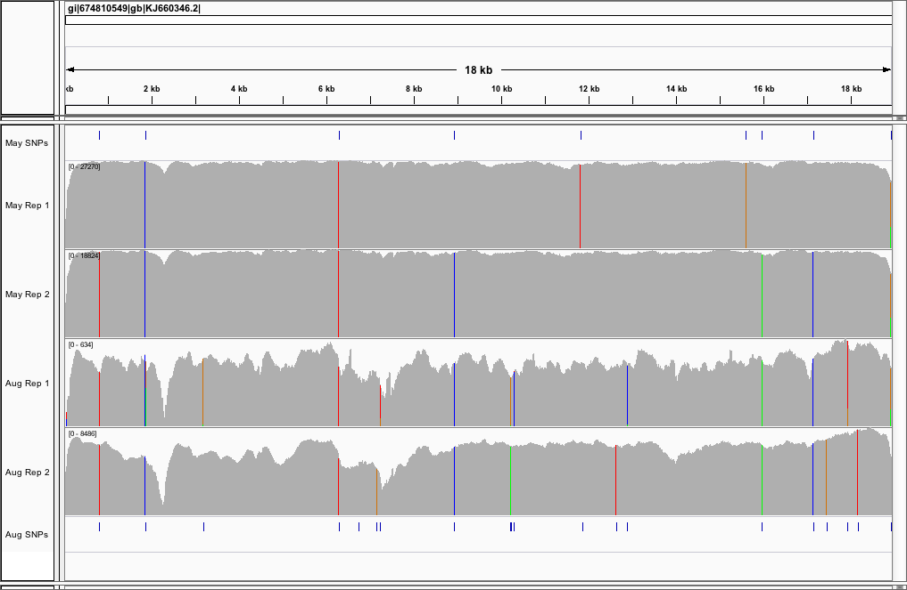
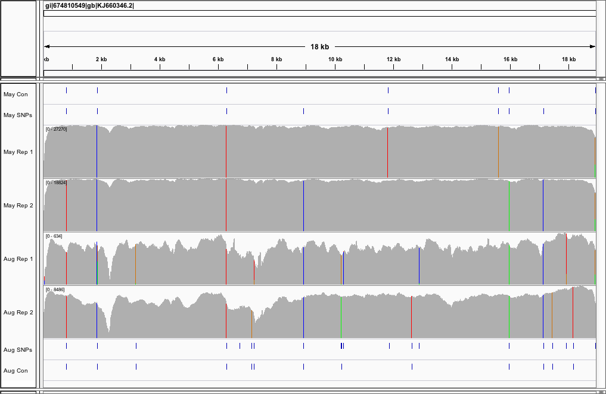
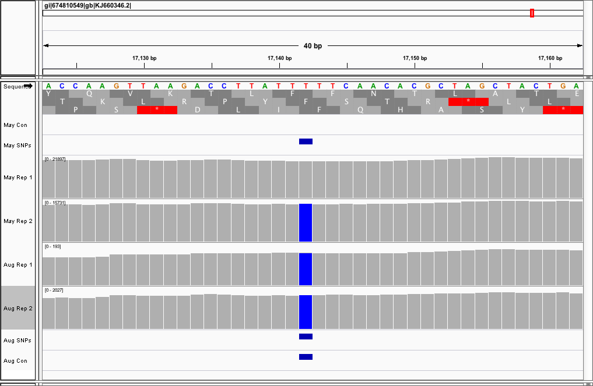

```{r, include=F, echo=F}
library(readr)
```

# Comparative Ebola Genomics

This report connects the homework for units 7, 8, 9, and 10. I'll be looking to recreate a small piece of the analysis done in Gire et al. 2014 where I look at ebola isolates sampled at different time points during 2014 to see if I can differentiate them by their variant calls. I included two biological replicates per timepoint that were collected on the same day. It should be noted that while the June and August samples were sequenced on April of 2015 the May samples were sequenced August of 2014. Normally this could lead to potential batch effects but since we're looking at whole genome sequencing samples that may not be the case. The ebola genome is made of RNA, not DNA, so my assumption may be wrong.

Collection Dates and Accessions:

* May 28th    - `SRR1553468` & `SRR1553464`
* June 28th   - `SRR1972602` & `SRR1972603`
* August 30th - `SRR1972861` & `SRR1972852`

That information can be found [here](http://www.ncbi.nlm.nih.gov/Traces/study/?acc=SRP045416).

The reference genome I'll be comparing these samples to is the assembly in Figure 4 of Gire et al. 2014, the Kissidougou Guinean sequence (accesion KJ660346).

Here I'll use samtools and bcftools to actually call variants and visualize them in IGV.

## Variant Analysis 

### Overview

Using samtools and bcftools I called for SNPs within each sample independently using the following command:

```
$ samtools mpileup -ugf $REF $aln | bcftools call -cv > results.vcf
```

I called variants on each replicate separately and together to get a good representation of the genomic diversity and consensus per time point. Ideally you'd have more replicates at each time point to truly know what the majority of the viral population looks like.

Again because the June samples barely mapped any reads at all it's been ommitted for this analysis.

### Variant Diversity

Below is an image of the alignment of both replicates for both time points. Above and below are interval tracks of the SNPs called by samtools and bcftools. I transformed them to BED format because they were easier to work with and simpler that way in my opinion. At first glance you notice several things:

1. There are more SNPs in August than in May compared to the reference which makes sense - the virus is changing and adapting over time.
2. The replicates in August are more similar than the replicates in May
3. Most variants still exist within the population in August that arose in by May while a minority have disappeared.



### Variant Consensus

If we now add the consensus variants, that is the variants that survive variant calling once we add both replicates together to give our variant calls more power we can see the number start to go down. Again, ideally you'd have more replicates to get a better idea of which ones are representative of the virus within the patient population at large.



### Digging Deeper

Here we see an image of a SNP that was present in May in one patient virus population but not in another. In August, both virus replicates from two patients have the SNP. Just by seeing that I would interpret that the SNP offered an advantage to the virus and it eventually became fixed within the population.



If we look more closely at this variant we can see that the mutation takes it from a T to a C. If this is real, it seems to have evidence supporting a fitness advantage of some kind. Based on the sequence track you can see above, and looking at the potential open reading frames, it's either causing an amino acid change of phenyl-alanine to serine or to leucine if this is found within a coding domain sequence.

If it going from phenyl-alanine to leucine, that change would be a mostly conservative substitution while if it was going from phenyl-alanine to serine it would represent a more dramatic substitution. You can see this in the [codon table](http://bioinfo.bisr.res.in/project/crat/pictures/codon.jpg) and amino acid conservation [venn diagram](http://www.ctu.edu.vn/~dvxe/Bioinformatic%20course/mod4/mod3_extra/venn-diagram.gif).