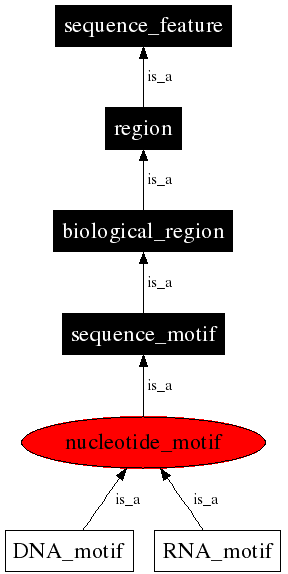

## Command Line Questions

#### What flags will make the ls command write out the file sizes in a more user-friendly format?

Using the **ls -lh** command can do this for you

#### What flag will make the rm command ask your permission before removing a file?

Using the **rm -i** command can do this for you

#### What flag will make the cp command ask for permission before clobbering?

Using **cp -i** will do the same as **rm -i** in that it will interactively ask you whether you're sure you want to overwrite an existing file. Using **cp -n** will prevent clobbering altogether. 

#### To make the ref, bin, and src directories I used...

mkdir -p $HOME/applied-bioinformatics/ref $HOME/applied-bioinformatics/bin $HOME/applied-bioinformatics/src

## Ontology Search

I searched for DNA motif on [the sequence ontology](http://www.sequenceontology.org/) browser and it gave me the screenshot below. It has no children and is 5 nodes from the top. It shares an indirect relationship with an RNA motif as they are both nucleotide motifs. These are both sequence motifs, which are biological regions, which are regions, which are sequence features.

