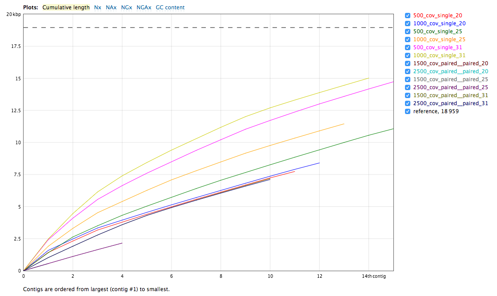
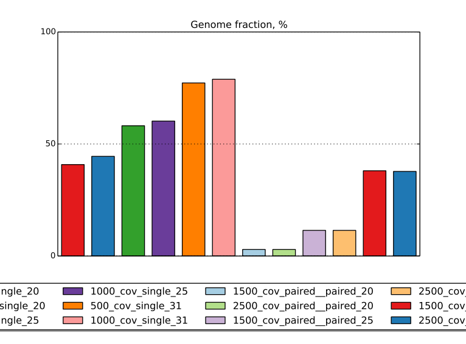
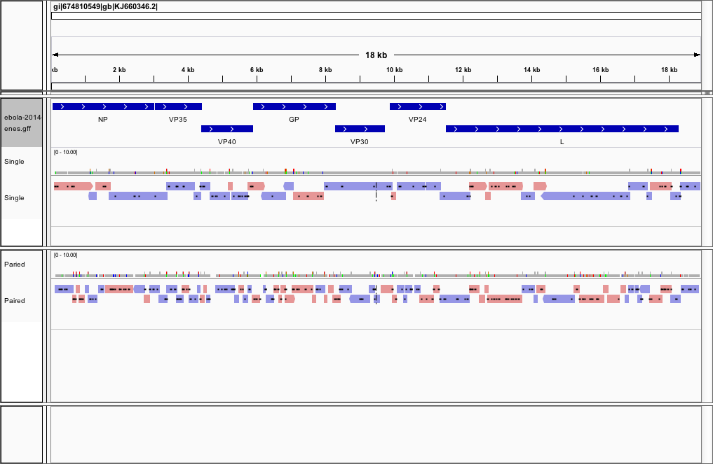
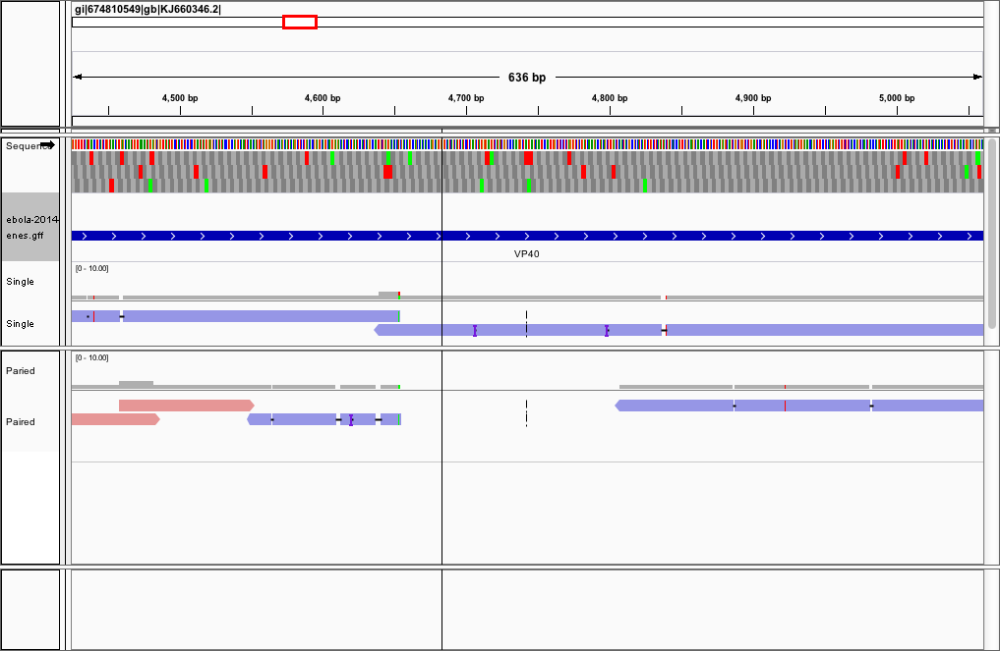
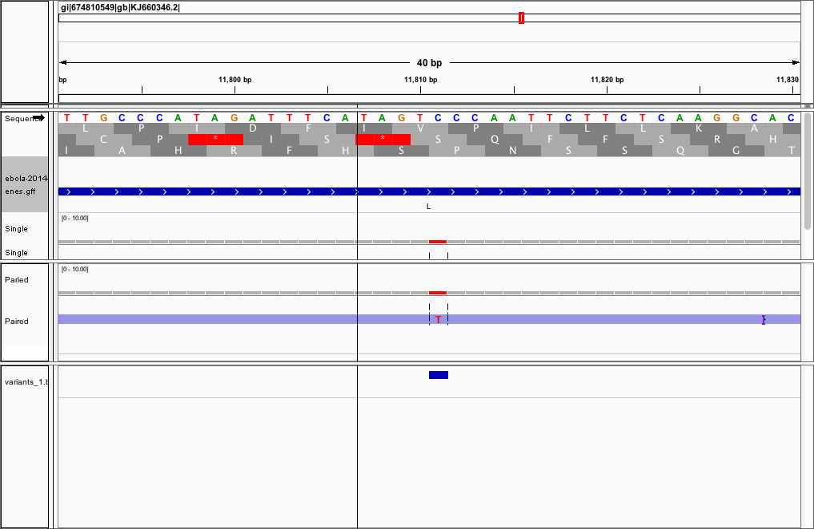

```{r, include=F, echo=F}
library(readr)
```

# Ebola Virus Assembly w/ Velvet

First I downloaded reads from SRA Accession SRR1553468. I've already mapped this sample back to the reference used in Gire at al. 2014 and it maps at close to 90% so there are plenty of ebola reads within this run. If anything this is a good example of more than enough data considering the size of the ebola genome.

In order to do a parameter sweep I changed three input parameters.

1. Whether I assembled with single or paired end reads
2. The kmer size
3. the coverage cutoff

## What is N50?

N50 is similar to a median when looking at contig lengths and the assembly. You want your N50 score to be as high as possible as it represents the length of the shortest contig that can produce at least half of the bases of your assembly. So if your N50 statistic is high then it's likely your distribution of contigs contains large contigs on average while if your statistic is low your distribution is made up of many smaller contigs. This is all relative to the reference genome.

## Assembly Results

### QUAST Report

Below you see the cumulative length distributions of each assembly performed.



The runs with a single read set did better every time! Even when the kmer length was smaller. This was really unexpected. As you can see from the plot below when looking at fraction of the genome that's actually covered, you can see a consistent improvement when increasing the kmer length. The graphs to the left are all single end read assemblies while the graphs starting in the middle to the right are all paired end read assemblies.



The best paired end read assembly I was able to create gave an **N50 of 803 and 73 contigs.** On the other hand the best single end read assembly gave an **N50 of 29 contigs.** The total length of the single end assembly was at best ~15kb while for the paired end assembly ~7kb.

### Realigning the Contigs

Below is an image of a realignment of the contigs produced by the best assemblies for both single and paired end assembly runs as determined by their N50 statistic.



It's immediately easy to see that there are far more pieces in the paired end data set. In addition what also looks like far more mismatches. This is confirmed within the QUAST report where it tells us that the number of mismatches per 100kb is ~343 for our single end assembly and about ~642 for our paired end assembly.

What I also found interested was that it was aligning these reads to both the forward and reverse strands. I would expect them to all align to the same strand considering ebola is a single stranded RNA virus and within single end reads you're only sequencing in one direction of the fragment.

You also see a significant amount of overlap between the contigs. I'm not sure this is how they're meant to map back to reference but if it is then a scaffolding program could take advantage of this information.

Below is an example of a definite assembly gap.



These are actually difficult to see in the single end assembly but here in the paired end assembly we can see a gap of about 150bps. A pretty substantial amount considering the ebola genome is only 18-19kb depending on the strain. Not to mention it's right in the middle of VP 40, a protein coding gene.

## Conclusions

Overall it was very difficult to determine the quality of my assembly. There were many mistakes when I looked to realign the contigs back to the reference. If we look back at the variants called on this read set, you can see that the assembler was able to actually assemble them correctly. Here's an example below of a SNP in VP24:



We do however, see though that we get very high coverage over protein coding genes and if a scaffolding step was incorporated the assembly would most likely improve greatly based on the realignment.