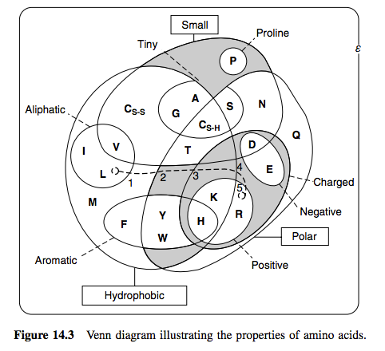
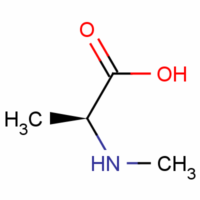
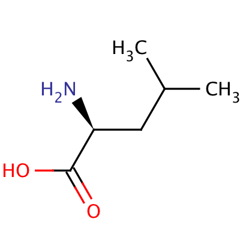
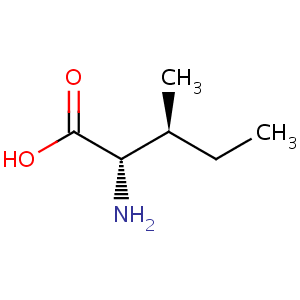
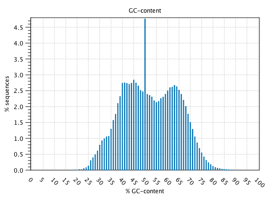
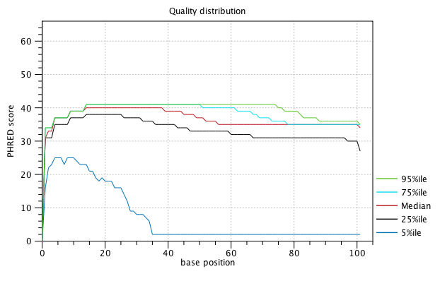
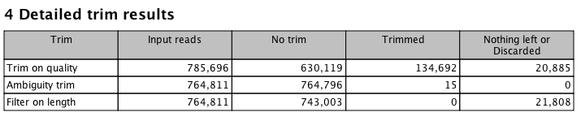
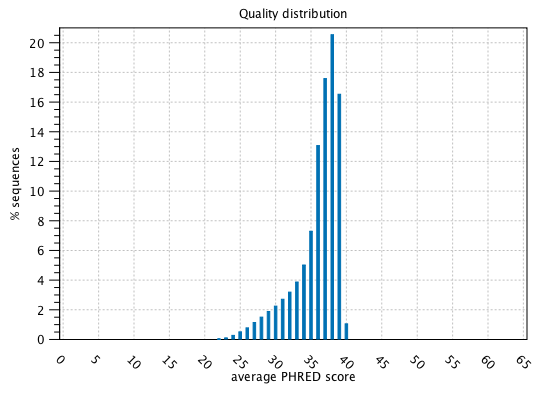
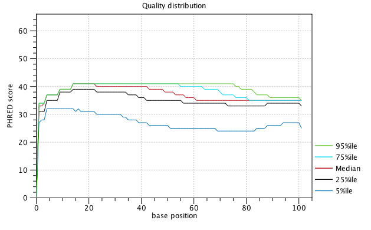
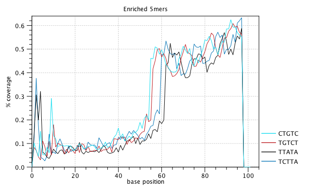

#### Disclaimer

Since I've been writing my homework assignments in [RStudio](https://www.rstudio.com/) and am interested in using R to do bioinformatics I decided that I'd supplement the use of the EMBOSS web server to do pairwise alignment with the Bioconductor package, [Biostrings](http://bioconductor.org/packages/release/bioc/html/Biostrings.html). I've read briefly about its ability to work with sequences and wanted to test it out. Not to mention since starting my journey into bioinformatics I've shied further and further away from GUI interfaces (except for Galaxy and RStudio which I think are awesome). I'm sorry if this causes any unnecessary reading. Hopefully the table of contents above can move you around the document with enough ease.

## Recreating a Local Alignment Result Using EMBOSS

### Accidental Global Alignment

I made the mistake of performing a global alignment first using the Needleman-Wunsch algorithm but unlike in the local alignments I was able to see something I didn't understand right away because I've never worked with amino acid sequences before. I know that the `"|"` character means there are matching amino acid residues. But I didn't know what the `"."` or the `":"` stood for. I knew it must mean some kind of similarity between residues that had biochemical and/or experimental backing to it but wasn't sure what.

```{r, global-default, comment="", warning=F}
require(readr, quietly = TRUE)
global <- read_file("emboss/global_default.txt")
cat(global)
```

If we look above we can see that the amino acids Leucine (L) and Alanine (A) have a `"."` while Leucine and Isoleucine (I) have a `":"` separating them. Wikipedia to the rescue! According to the [wikipedia article](https://en.wikipedia.org/wiki/Sequence_alignment) on sequence alignment the double dot notation means the two residues are related by what's considered a conservative mutation while the single dot notation means the same thing but now it's just a semi-conservative mutation. So what the heck does that mean? As dangerous as clicking recursively on Wikipedia articles can be I still wasn't sure what that meant exactly.

### On Substitutions and Mutations Within Sequences

**This is a tangent and not at all part of the homework. I just like being thorough.**<br> 
**Skip it if you just wanna give this a grade and go to bed.**<br>

To put this into context we need to first consider the [central dogma of molecular biology](https://en.wikipedia.org/wiki/Central_dogma_of_molecular_biology) which generally describes the flow of information between DNA, RNA, and proteins. I use the word generally because the framework dates back to the 1950s and we've learned a lot since then which the central dogma doesn't account for. But that's a different discussion entirely. 

The central dogma states that information flows from DNA to RNA to AA following certain rules. What we know thus far is that a set of three DNA bases (referred to as a codon) is translated to one AA. The number of possible number of combinations where order matters of codons is 64 (4 raised to the third power). However, protein translation only involves 20 amino acids. Thus we say that the genetic code is degenerate or in other words has a built in mechanism of redundancy when it comes to moving from DNA to RNA to AA. In other words, multiple codons can encode for the same amino acid.

#### Mutations Are Not Substitutions?

This is important because when you look at similarities and differences in sequences you come across two terms: **mutation** and **substitution**. According to [Wikipedia](https://en.wikipedia.org/wiki/Synonymous_substitution), these don't mean the same thing although I've seen them used interchangeably. Referring to DNA, a mutation or substitution is when you notice a single nucleotide that has undergone a change. This happens naturally over time for all genomes - in some more quickly than others. This change can lead to a difference in the amino acid residues that make up a protein since you're talking about changing the nucleotides that make up a codon. 

When defining that base change at the DNA level you can either call it a nucleotide mutation or substitution. It's referred to as a mutation when you're referring to genomes that exist within a population where you have mutant and wild-type individuals. It's referred to as a substitution when you're referring to genomes that exist between two separate populations. Thus a mutation can become a substitution once a mutation becomes fixed within a population.

I haven't personally read any literature on the topic so I looked to the [Sequence Onotology](http://www.sequenceontology.org/) for guidance but it wasn't much help. If you search for "mutation" you're brought to "*sequence_variant_obs*" which has no children and no parents. It's its own individual node. It makes sense because mutation is a very vague term but I was hoping for something that possibly connected it with a substitution, similar to the way the Wikipedia article described it.

On the other hand if you search for "substitution" you get the following tree:


In addition you get an entirely different one if you're looking specifically at "amino_acid_substitution":


We can see that we're starting to find our way back to the terms *conservative* and *non-conservative* substitutions and now that I have a better idea regarding what a substitution, I decided to move on.

#### Conservative, Semi-Conservative, and Non-Conservative Amino Acid Substitutions

A popular tool for looking at pairwise and multiple alignments between proteins is called [ClustalW2](http://www.ebi.ac.uk/Tools/msa/clustalw2/). It turns out the EMBL also has a web server to do alignments using ClustalW2 and has a [help page](http://www.ebi.ac.uk/Tools/msa/clustalw2/help/faq.html#23) where we can look to see what the output symbols stand for. This may not be the exact meanings of what they mean when running the other pairwise alignments tools through EMBOSS but I'm just going to stick with what they say here and extrapolate it to protein alignments in general.

It turns out that ClustalW2 uses an asterisk (`"*"`) for describing a conserved residue (instead of a `"|"`). Then it says that a `":"` indicates conservation between groups of strongly similar properties while a `"."` indicates conservation between groups of weakly similar properties. It apparently uses a scoring matrix (sometimes called a mutation matrix) to determine whether the substitution has a score above a certain threshold to determine whether we're looking at a conservative or semi-conservative substitution. And that score is based on empirical values looking at similarities in physio-chemical properties between amino acid residues such as its size, polarity, hydrophobicity, acidity, etc. These properties are determined by their side chains.

Thus determining what kind of substitution we're looking at, determining whether we have conserved domains within proteins, and ultimately deriving function from those conserved domains is partially determined by whether you call these substitutions strongly or weakly conserved (or not at all).

**So how do these relationships hold up for the global alignment I constructed above?**

What we see in the above alignment is that it's calling a strong relationship between Leucine and Isoleucine and a weak relationship between Leucine and Alanine. Doing a quick google search brought me upon this reference on [Amino Acid Properties](https://biokamikazi.files.wordpress.com/2013/06/aminoacid_and_substitutions.pdf). From here is where I'll draw some quick conclusions regarding their relationships. A quick and easy way to visualize relationships between amino acids is provided in figure 14.3 below. They based this on a [paper by William Taylor](http://www.sciencedirect.com/science/article/pii/S0022519386800753).



**Alanine and Leucine**

Alanine is substitutable by any other small amino acids. It's labeled as a very "dull" amino acid as it's not very hydrophobic and nonpolar. It puts constraints on protein conformation and can play a role in substrate recognition. Otherwise it's relatively non-reactive.

Leucine on the other hand is a hydrophobic amino acid and prefers to be buried within a protein pocket along with other hydrophobic amino acids. However, it is also a relatively non-reactive amino acid and involved in substrate recognition which I guess is where we see it's weak relationship with Leucine.

Below is a chemical structure of both amino acids:

**Alanine**
**Leucine**

**Leucine and Isoleucine**

The strong relationship can already be easily seen by just looking at the two names. Most of the differences between these molecules have to do with structure. If you look at the chemical structure below you'll see that it's the placement of a single methyl group that tells the story..

**Isoleucine**

#### Overall Takeaways

Based on a brief look into sequence similarity calculations, it seems that one determines similarity between sequences based on a scoring matrix that was derived from empirical data and if you're not working with "standard" sequences this can become a problem. It's important to know what the limitations of your alignment are and/or what you might be missing.

The reason I mention this is because my lab works on Plasmodium - a eukaryotic unicellular parasite whose genome is radically different than most model organisms. It has historically been very difficult to characterize proteins within Plasmodium do to a lack of sufficient sequence similarity to define homologous protein binding domains found within other species. Roughly half of all known protein coding genes within *Plasmodium falciparum* code for proteins of "unknown" or "putative" function. So I'm naturally curious as to why sequence alignment methods haven't been able to capture many relationships that don't seem to be as difficult in other organisms. 

Based on this I would argue that pairwise sequence alignment can sometimes have severe limitations because I doubt the experts that curate the *Plasmodium* genome are so incompetent that they haven't tried aligning genome and protein sequences in hundreds of different ways. But I'm assuming that most scientists discovered this limitation a long time ago and I'm only realizing it now because it's the first time I've looked into it. Fascinating stuff!

### Local Alignment 

I finally got around to actually performing the local alignment using the Smith-Waterman algorithm and found that if I edit the gap pentalty to 1 then you get the desired alignment. Those two internal gaps make all the difference. Now that the pentaly for them is so low this gives you the maximum score. However, I think in general internal gaps are highly penalized for a reason. If you're looking for conserved domains then you wouldn't expect to find many internal gaps because this could seriously disrupt function of those domains.

```{r, local-gap-penalty-1, comment="", warning=F}
local <- read_file("emboss/local_gap_penalty_1.txt")
cat(local)
```

## Pairwise Alignment Using Biostrings

The Biostrings package has been in Bioconductor for over 10 years so the authors have been able to develop and add to it for a long time. It forms the base of most of Bioconductor's packages that rely on any type of sequence manipulation and analysis. It can perform:

* Sequence manipulations such as masking and trimming  
* Handle multiple alignment results  
* Perform pairwise alignment  
* Perform classic string matching and position weight matrix searches

Since we're looking at pairwise alignment in this unit I'll stick with those functionalities for this homework. First let's just do a local alignment of the two protein sequences we were working with prior. Let's do both a local and global.

```{r, biostrings-local, comment="", warning=F}
suppressMessages(require(Biostrings))
s1 <- AAString("THISLINE") 
s2 <- AAString("ISALIGNED")
pairwiseAlignment(pattern = s1, subject = s2, type = "local")
```

```{r, biostrings-global, comment="", warning=F}
pairwiseAlignment(pattern = s1, subject = s2, type = "global")
```

Curiously enough this isn't what I get by putting these sequences into the EMBOSS server and using the default parameters. Let's make sure the gap penalities are the same.

```{r, biostrings-add-gaps, comment="", warning=F}
pairwiseAlignment(pattern = s1, subject = s2, type = "local", gapOpening = 10, gapExtension = 0.5)
pairwiseAlignment(pattern = s1, subject = s2, type = "global", gapOpening = 10, gapExtension = 0.5)
```

We get the same output for the local alignment but for the global alignment we finally see a different score. So maybe it has to do mostly with the default scoring matrix?

```{r, biostrings-add-scoring, comment="", warning=F}
pairwiseAlignment(pattern = s1, subject = s2, type = "local", 
                  gapOpening = 10, 
                  gapExtension = 0.5, 
                  substitutionMatrix = "BLOSUM62")
pairwiseAlignment(pattern = s1, subject = s2, type = "global", 
                  gapOpening = 10, 
                  gapExtension = 0.5,
                  substitutionMatrix = "BLOSUM62")
```

I can't reproduce the alignment and already don't like the minimal output I get. The package does include some helper functions though so let's try changing the gap penalty to see what happens to the local alignment results and then run the `summary` function.

```{r, biostrings-summary, comment="", warning=F}
aln <- pairwiseAlignment(pattern = s1, subject = s2, type = "local", gapOpening = 1, gapExtension = 0.5, substitutionMatrix = "BLOSUM62")
aln
summary(aln)
```

The alignment looks correct but the score is different. Why? The summary function I also don't find particularly useful here. Lastly I don't like how non of the above alignments showed a weak or strong association like the EMBOSS output did. Overall, I'm not entirely sure how it's working here and why the results aren't comparable. Could it be that the implementation of the algorithms is different in Biostrings?

## Quality Control in CLC Genomics Workbench

I decided to analyze run SRR1553424 for my CLC Genomics QC test.

One thing that's cool is you can take a look at the raw sequences with this little bar graph that tells you the quality of each base. You can already see some reads that need to be trimmed and one that may need to be discared based on how long it will be after trimming.


### Initial QC Report

The output of the QC report contains a lot of the same reports given to you by FastQC. As described in the lecture video however, they aren't always exactly the same.

For example I'm not sure how FastQC does it's GC content calculations but I'm not sure I've ever seen a bimodal distrbution as seen below.



I like the quality distribution plot that it outputs because you can actually see what the quality scores are for the best and worst sequences in your dataset. It will be interesting to see what this one will look like after trimming.



Otherwise you see many of the same types of plots such as a kmer analysis, a sequence quality distribution, and nucleotide contributions per base.

### Quality Trimming and Length Filtering

Here I performed quality trimming by removing bases that fell below the 5th percentile in quality scores and fell below a length of 35 nucleotides. I do not know which adapters were used so I did not trim for those.

The nice thing about the trimming function is that it presents you with a brief report that shows you some before and after trimming numbers. Similar to prinseq it also tells you how many reads were trimmed and/or removed for which reason such as whether they were below the quality threshold or whether they were too short to keep. Below is an example.



### After Trimming QC Report

You immediately notice in some plots that there has been a clear improvement. If you look at per sequence quality distribution you no longer see a long tail that used to extend outwards towards scores below 20.



As expected the trimmed base quality distribution plot looks much better than the one above.



The kmer enrichment plot however looks far more pronounced.



It's interesting because it does appear to be trending. However, another difference to the kmer plot prior to trimming is that each kmer now appears to be enriched just as much as any other at any other position if you follow the general trend. If anything, it's possible we actually removed a bias from the earlier data set despite the fact that this looks initially a little weird.

