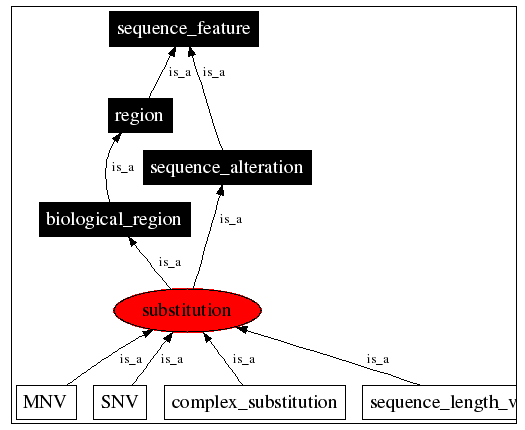
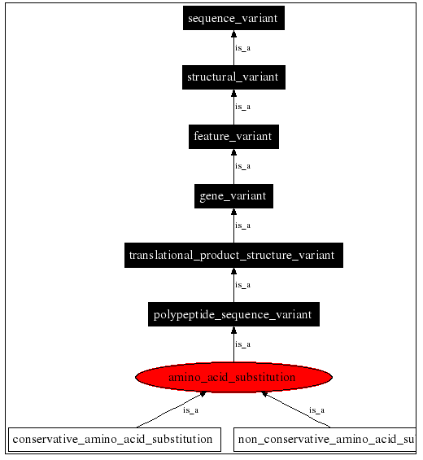

#### Disclaimer

Since I've been writing my homework assignments in [RStudio](https://www.rstudio.com/) and am interested in using R to do bioinformatics I decided that I'd supplement the use of the EMBOSS web server to do pairwise alignment with the Bioconductor package, [Biostrings](http://bioconductor.org/packages/release/bioc/html/Biostrings.html). I've read briefly about its ability to work with sequences and wanted to test it out. Not to mention since starting my journey into bioinformatics I've shied further and further away from GUI interfaces (except for Galaxy and RStudio which I think are awesome). I'm sorry if this causes any unnecessary reading. Hopefully the table of contents above can move you around the document with enough ease.

## Recreating a Local Alignment Result using EMBOSS

### Accidental Global Alignment

I made the mistake of performing a global alignment first using the Needleman-Wunsch algorithm but unlike in the local alignments I was able to see something I didn't understand right away because I've never worked with amino acid sequences before. I know that the `"|"` character means there are matching amino acid residues. But I didn't know what the `"."` or the `":"` stood for. I knew it must mean some kind of similarity between residues that had biochemical and/or experimental backing to it but wasn't sure what.

```{r, global-default, comment="", warning=F}
require(readr, quietly = TRUE)
global <- read_file("emboss/global_default.txt")
cat(global)
```

If we look above we can see that the amino acids Leucine (L) and Alanine (A) have a `"."` while Leucine and Isoleucine (I) have a `":"` separating them. Wikipedia to the rescue! According to the [wikipedia article](https://en.wikipedia.org/wiki/Sequence_alignment) on sequence alignment the double dot notation means the two residues are related by what's considered a conservative mutation while the single dot notation means the same thing but now it's just a semi-conservative mutation. So what the heck does that mean? As dangerous as clicking recursively on Wikipedia articles can be I still wasn't sure what that meant exactly.

### On Substitutions and Mutations Within Sequences

_**This is a tangent and not at all part of the homework. I just like being thorough. Skip it if you just wanna give this a grade and go to bed.**_

To put this into context we need to first consider the [central dogma of molecular biology](https://en.wikipedia.org/wiki/Central_dogma_of_molecular_biology) which generally describes the flow of information between DNA, RNA, and proteins. I use the word generally because the framework dates back to the 1950s and we've learned a lot since then which the central dogma doesn't account for. But that's a different discussion entirely. The central dogma states that information flows from DNA to RNA to AA following certain rules. What we know thus far is that a set of three DNA bases (referred to as a codon) is translated to one AA. The number of possible combinations where order matters of codons is 64 (4 raised to the third power). However, protein translation only involves 20 amino acids. Thus we say that the genetic code is degenerate or in other words has a built in mechanism of redundancy when it comes to moving from DNA to RNA to AA.

#### Mutations Are Not Substitutions?

This is important because when you look at similarities and differences in sequences you come across two terms: **mutation** and **substitution**. According to [wikipedia](https://en.wikipedia.org/wiki/Synonymous_substitution), these don't mean the same thing although I've seen them used interchangeably. Referring to DNA, a mutation or substitution is when you notice a single nucleotide that has undergone a change. This happens naturally over time for all genomes - in some more quickly than others. This change can lead to a difference in the amino acid residues that make up a protein since you're talking about changing the nucleotides that make up a codon. 

When defining that base change at the DNA level you can either call it a nucleotide mutation or substitution. It's referred to as a mutation when you're referring to genomes that exist within a population where you have mutant and wild-type individuals. It's referred to as a substitution when you're referring to genomes that exist between two separate populations. Thus a mutation can become a substitution once a mutation becomes fixed within a population.

I haven't personally read any literature on the topic so I looked to the [Sequence Onotology](http://www.sequenceontology.org/) for guidance but it wasn't much help. If you search for "mutation" you're brought to "*sequence_variant_obs*" which has no children and no parents. It's its own individual node. It makes sense because a mutation is a very vague term but I was hoping for something that possibly connected it with a substitution somehow, similar to the way the Wikipedia article described it.

On the other hand if you search for "substitution" you get the following tree:



In addition you get an entirely different if you're looking specifically at "amino_acid_substitution":



But we can see here that we're starting to find our way back to these terms *conservative* and *non-conservative* substitutions and now that I have a better idea regarding what a substitution, I decided to move on.

#### Conservative, Semi-Conservative, and Non-Conservative Amino Acid Substitutions

A popular tool for looking at pairwise and multiple alignments between proteins is called [ClustalW2](http://www.ebi.ac.uk/Tools/msa/clustalw2/). It turns out the EMBL also has a web server to do alignments using ClustalW2 and has a [help page](http://www.ebi.ac.uk/Tools/msa/clustalw2/help/faq.html#23) where we can look to see what the output symbols stand for. This may not be the exact meanings of what they mean when running the other pairwise alignments tools through EMBOSS but I'm just going to stick with what they say here and extrapolate it to protein alignments in general.

It turns out that ClustalW2 uses an asterisk (`"*"`) for describing a conserved residue (instead of a `"|"`). Then it says that a `":"` indicates conservation between groups of strongly similar properties while a `"."` indicates conservation between groups of weakly similar properties. It apparently uses a scoring matrix to determine whether the substitution has a score above a certain value to determine whether we're looking at a conservative or semi-conservative substitution. And that score is based on empirical values looking at similarities in physio-chemical properties between amino acid residues such as its size, polarity, hydrophobicity, acidity, etc. For ClustalW2 this is also what's used to color the residues when looking at a multiple alignment to enhance the visualization.

Thus determining what kind of substitution we're looking at, determining whether we have conserved domains within proteins, and ultimately deriving function from those conserved domains is partially determined by whether you call these substitutions strongly or weakly conserved (or not at all).

While I won't argue at all that it's worked out well for the field of molecular biology nor that the bioinformaticians that came up with these frameworks were in any way lacking in creativity and intelligence, my intuition takes me towards a complex systems perspective of sequence alignment where you're limited in understanding what these sequences and their similarities really mean since you're reducing it's components into individual attributes and even removing certain information (tertiary and quaternary protein structure)

#### So You Were Talking About Aligning Sequences Earlier...

Based on a brief look into sequence similarity calculations, it seems that one determines similarity between sequences based on a scoring matrix that was derived from empirical data and if you're not working with "standard" sequences this can become a problem. It's important to know what the limitations of your alignment are and/or what you might be missing.

The reason I mention this is because my lab works on Plasmodium - a eukaryotic unicellular parasite whose genome is radically different than most model organisms. It has historically been very difficult to characterize proteins within Plasmodium do to a lack of sufficient sequence similarity to define homologous protein binding domains found within other species. Roughly half of all known protein coding genes within *Plasmodium falciparum* code for proteins of "unknown" or "putative" function. So I'm naturally curious as to why sequence alignment methods haven't been able to capture many relationships that don't seem to be as difficult in other organisms. 

Based on this I would argue that pairwise sequence alignment can sometimes have severe limitations because I doubt the experts that curate the *Plasmodium* genome are so incompetent that they haven't tried aligning genome and protein sequences in hundreds of different ways. But I'm assuming that most scientists discovered this limitation a long time ago and I'm only realizing it now because it's the first time I've looked into it. Fascinating stuff!