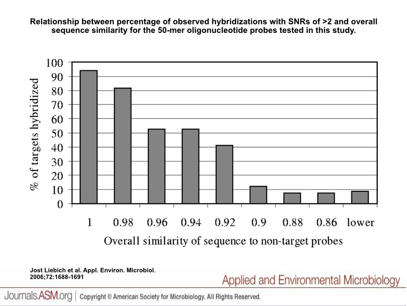
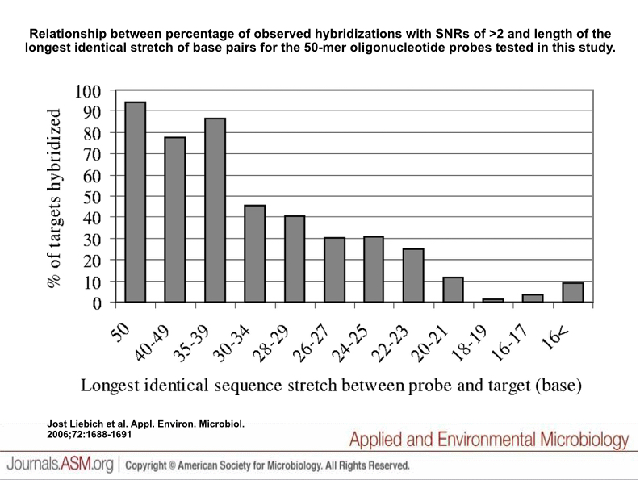

```{r, setup, include=F, echo=F}
library(readr)
library(Biostrings)
library(msa)
```

# Overview

Sequence alignment is fundamental to analyzing genomics data. Here I'll look to understand pairwise alignment using BLAST+ and multiple sequence alignment using the bioconductor package, [msa](http://bioconductor.org/packages/release/bioc/html/msa.html). I'll be looking at data from multiple ebolavirus outbreaks and new data that relates Plasmodium species to recently sequenced Chromerids through a common unicellualar phototrophic ancestor. But first I wanted to understand how BLAST works.

## Understanding and Tuning BLAST

One of the great things about BLAST is its flexibility. BLAST is made up of with the following five programs:

1. blastn
2. blastp
3. blastx
4. tblastn
5. tblastx

Each program is tailored for different inputs and for answering slightly different questions. In addition each program comes with a set of tasks that optimize certain parameters so as to find an answer to your specific question of interest. It's important to understand the purposes of these programs and tasks so you can properly filter false positives and make sure you're minimizing false negatives.

It's useful to treat each BLAST run as an in silico experiment. Those experiments tend to fall into two categories: mapping and exploring. In order to get a better fundamental understanding of BLASTN I wanted to try one of each using the most recent sequence annotations of *Plasmodium falciparum* as found on [PlasmoDB](http://plasmodb.org).

### Mapping Oligos to the Transcriptome

First I wanted to try mapping an oligo to part of the genome, specifically the transcriptome, which can sort of fall under mapping and exploration depending on how you look at it. There are various applications that answering this question can be useful for and one of those is DNA microarrays. When measuring gene expression using DNA microarrays you design the oligos on the array so that they are as unique as possible to your gene of interest. Let's try to do this using a notoriously difficult gene to quantify in Plasmodium, PfEMP1.

PfEMP1 represents a gene family within Plasmodium that it uses to escape immune detection within a red blood cell. It contains many copies of this gene (~60) within its nuclear genome and these genes tend to be at chromosomal periferies (subtelomeric) making them more frequent targets of mutation.

I wanted to take a subsequence of PfEMP1, specifically PF3D7_0200300, and map it back to the list of P. falciparum transcripts and see what BLAST tells us.

Microarray technology today can consist of oligos around 60 nucleotides in length so that's the length of the sequence I decided to use as a query.

My gene of interest looks like this:

```{r, comment=""}
pfemp1 <- readDNAStringSet("data/plasmodium/pfemp1.fasta")
pfemp1
```

And the 60mer I extracted from this gene looks like this:

```{r, comment=""}
pfemp1_query <- readDNAStringSet("data/plasmodium/pfemp1_query.fasta")
pfemp1_query
```

#### Create Blastdb

First let's make a blast database of all P. falciparum transcript sequences.

```
$ makeblastdb -in pf_transcripts.fasta -dbtype nucl -parse_seqids


Building a new DB, current time: 07/31/2015 03:41:45
New DB name:   /applied-bioinformatics/unit6/data/plasmodium/pf_transcripts.fasta
New DB title:  pf_transcripts.fasta
Sequence type: Nucleotide
Keep Linkouts: T
Keep MBits: T
Maximum file size: 1000000000B
Adding sequences from FASTA; added 5777 sequences in 1.11294 seconds.
```

Done in a little over a second!

#### Results of Megablast

Next I ran the following command:

```
$ blastn -task megablast | 
  -db data/plasmodium/pf_transcripts.fasta | 
  -query data/plasmodium/pfemp1_query.fasta |
  -outfmt '7 qseqid sseqid length pident evalue'
```

The output of which looks like this:

```
# BLASTN 2.2.31+
# Query: pfemp1-query
# Database: data/plasmodium/pf_transcripts.fasta
# Fields: query id, subject id, alignment length, % identity, evalue
# 3 hits found
pfemp1-query    PF3D7_0200300   60      100.00  1e-25
pfemp1-query    PF3D7_0200800   60      95.00   1e-20
pfemp1-query    PF3D7_0732100   60      93.33   5e-19
# BLAST processed 1 queries
```

So we can already see that the sequence I selected isn't unique to my gene of interest (the top hit).

#### Results of Blastn

Next I ran the following command:

```
$ blastn -task blastn |
  -db data/plasmodium/pf_transcripts.fasta |
  -query data/plasmodium/pfemp1_query.fasta |
  -outfmt '7 qseqid sseqid length pident evalue'
```

And this time my output looks like this:

```
# BLASTN 2.2.31+
# Query: pfemp1-query
# Database: data/plasmodium/pf_transcripts.fasta
# Fields: query id, subject id, alignment length, % identity, evalue
# 35 hits found
pfemp1-query    PF3D7_0200300   60      100.00  5e-25
pfemp1-query    PF3D7_1300800   60      95.00   1e-20
pfemp1-query    PF3D7_0200800   60      95.00   1e-20
pfemp1-query    PF3D7_0115500   60      95.00   1e-20
pfemp1-query    PF3D7_0732100   60      93.33   1e-19
pfemp1-query    PF3D7_0101700   60      93.33   2e-18
pfemp1-query    PF3D7_0222900   60      93.33   2e-18
pfemp1-query    PF3D7_0900800   60      93.33   2e-18
pfemp1-query    PF3D7_1372900   60      93.33   2e-18
pfemp1-query    PF3D7_0324700   60      93.33   2e-18
pfemp1-query    PF3D7_0302300   53      92.45   9e-16
pfemp1-query    PF3D7_0402800   60      88.33   3e-15
pfemp1-query    PF3D7_0300300   60      88.33   1e-14
pfemp1-query    PF3D7_0713300   53      90.57   4e-14
pfemp1-query    PF3D7_0532700   58      87.93   4e-14
pfemp1-query    PF3D7_0421600   50      88.00   2e-11
pfemp1-query    PF3D7_0420700   60      78.33   4e-07
pfemp1-query    PF3D7_0617400   59      77.97   2e-06
pfemp1-query    PF3D7_1000900   40      85.00   5e-06
pfemp1-query    PF3D7_1200600   35      85.71   2e-04
pfemp1-query    PF3D7_0100300   35      85.71   2e-04
pfemp1-query    PF3D7_0833300   35      85.71   2e-04
pfemp1-query    PF3D7_1338100   15      100.00  1.4
pfemp1-query    PF3D7_1426500   15      100.00  1.4
pfemp1-query    PF3D7_1442700   15      100.00  1.4
pfemp1-query    PF3D7_0405400   14      100.00  4.9
pfemp1-query    PF3D7_0517300   14      100.00  4.9
pfemp1-query    PF3D7_0103600   14      100.00  4.9
pfemp1-query    PF3D7_1475900   14      100.00  4.9
pfemp1-query    PF3D7_1014300   17      94.12   4.9
pfemp1-query    PF3D7_0609700   14      100.00  4.9
pfemp1-query    PF3D7_1007300   17      94.12   4.9
pfemp1-query    PF3D7_1466800   14      100.00  4.9
pfemp1-query    PF3D7_0203100   19      89.47   4.9
pfemp1-query    PF3D7_0311400   19      89.47   4.9
# BLAST processed 1 queries
```

I get a lot more hits this time. But why? Not to mention the top results are both similar and different.

### Interpreting the Results

As a beginner BLAST user I had the following questions:

1. Which results should I be paying attention to?
2. Should it be just to the output of one task or are the outputs complementary?
3. The outputs are ordered by E-value but is that what we care about here? Or is length or percent identity more important?

My initial question was to see where a specific 60mer mapped within transcripts genome wide. Biologically speaking, we wouldn't just take the top match because in order to anneal to one another, strands of DNA don't have to be exactly identical. They can have a certain amount of mismatches. So even though we see (as expected) a 100% match to the gene from which we extracted the 60 nucleotides we also see a match to many other genes with a high alignment length and percent identity.

**From a biological standpoint**, in order to determine whether this oligo can be used as a probe for our gene of interest we need to know how similar the sequences can be in order to allow for hybridization so that the array would give off a signal.

**From a bioinformatics standpoint**, in order to determine what our output means we need to better understand what megablast and blastn are doing differently. It must be that the `-task` flag changes input parameters behind the scences that gives us different results. But which parameters and why?

#### BLAST parameters

If we go to the [NCBI BLAST User Manual](http://www.ncbi.nlm.nih.gov/books/NBK279690/) we can see there's a chapter on [Options for the Command Line Applications](http://www.ncbi.nlm.nih.gov/books/NBK279675/). If we look at table C2 we can see that there are different default inputs depending on the `-task` parameter used. 

The parameters I'm interested in here are word_size, reward, and penalty.

**Word size** is a parameter used by BLAST to quickly find subsequences within the database with high enough similarity to the query sequence. Megablast has a default word_size of 28 nucleotides. Meaning that, BLAST will look for 28mers from the query sequence(s) and look for the same words of the same length within the database. Any sequence(s) within the database with this property is further evaluated. This is an easy way for BLAST to speed up its searches based on what the user is looking for.

**Reward and penalty** are part of the match/mismatch schoring scheme employed by BLAST. These values are used to calculate the various scores and statistics in the output. Thus, if you use the wrong scoring scheme, some sequences you're interested in may not be in your output.

If we look at the appendix within the BLAST manual we can see that there's a section entitled "BLASTN reward/penalty values." It tells us that the ratio of match to mismatch scoring is what's important in regard to the level of sequence "conservation" you're looking for. I think specificty might be a better word here since conservation has evolutionary implications and your application domain (such as this one) may not have evolutionary context.

NCBI also mentions the use of different **gap opening and gap extension penalties** and how that changes the scores given to alignments. In practice, gaps reduce the stringency of a scoring scheme, meaning an alignment score of 30 occurs more often in a collection of gapped alignments than it does in a similar collection of ungapped alignments. 

Whether we're interested in gapped alignments is a biological question that I'll try to answer later. Luckily, BLAST can perform both gapped and ungapped alignments and you can filter out any gapped alignments using the `-ungapped` flag.

#### What is megablast?

Going back to Table C2 of the BLAST manual, it describes the common uses of both megablast and blastn.

Megablast is commonly used to look for highly similar sequences and this sounds like what we're interested in. It has a default word size of 28, a default match reward of 1, mismatch penalty of -2, no cost to open a gap and a cost of 2.5 to extend a gap (gap extension cost is dependent on the match/mismatch scoring scheme).

The 1/-2 scoring scheme is best for sequences that are 95% "conserved."

#### What is blastn?

Blastn is commonly used for inter-species comparisons. So you might imagine that the defaults are less stringent in some way since sequences between species will most likely contain far more mismatches and potential gaps than intraspecies comparisons. It sounds like blastn is best for looking for conservation of simply a part of your query sequence(s) rather than megablast which comparatively sounds more like a global alignment of your query sequence(s). 

The default word size is 11, (much smaller!), the match/mismatch scoring scheme is 2/-3 (less stringent), and the gap open/gap extension costs are 5/2. For blastn we're more harshly penalizing gaps which makes sense if we're looking for similarity between much shorter sequences.

The 2/-3 scoring scheme is best for sequences that are between 95% and 75% "conserved."

#### Hybdridization Specificity

Not to forget the biological context of our question, I decided to do some research on microarray probe design.

Microarray probe design is nontrivial depending on your particular question of interest. For the pruposes of this assignment I'm interested in measuring gene expression accurately meaning I want to see that my probe doesn't hybridize well enough with other fragments of transcripts to give a false positive. I want my probe to be specific to my gene of interest. But what dictates sequence specificity?

According to [Liebich et al. 2006](http://www.ncbi.nlm.nih.gov/pubmed/16461729) three important factors to consider are sequence similarity, identical sequence stretches, and free energy. Since BLAST cannot calculate the free energy of my sequences we'll focus strictly on sequence similarity and contigous identical sequence stretches.

Based on figures 2 and 3 (below) the authors conclude that an appropriate cutoff for signal to noise ratio that dictates whether our oligo is binding a target sequence, are 90% in reference to sequence similarity and 20 nucleotides in reference to contiguous identical sequence stretches. Luckily, the paper also used 60mers in its experiments.




This answers my questions related to to what our word size should be and what our scoring scheme should be! Word size should then be set 20 while our scoring scheme can be a little less stringent than 1/-2 but not quite as lenient as -1/1. A scoring scheme of 2/-3 should work well.

I couldn't find in this paper anything in relation to gapped or ungapped alignments. When looking at a software tool from [X et al. 2005](http://www.ncbi.nlm.nih.gov/pubmed/16246912) I noticed that they did have an option for allowing gapped alignments. Without reading the entire paper, I decided that gapped alignments should be allowed as well in my analysis.

### Final Conclusions

After determing the appropriate paramters to tune BLAST I ran the following command:

```
$ blastn -task megablast |
  -db data/plasmodium/pf_transcripts.fasta |
  -query data/plasmodium/pfemp1_query.fasta |
  -word_size 20 -penalty -3 -reward 2 |
  -outfmt '7 qseqid sseqid length pident gaps evalue'
```

And got the following result:

```
# BLASTN 2.2.31+
# Query: pfemp1-query
# Database: data/plasmodium/pf_transcripts.fasta
# Fields: query id, subject id, alignment length, % identity, gaps, evalue
# 12 hits found
pfemp1-query	PF3D7_0200300	60	100.00	0	1e-21
pfemp1-query	PF3D7_1300800	60	95.00	0	1e-17
pfemp1-query	PF3D7_0200800	60	95.00	0	1e-17
pfemp1-query	PF3D7_0115500	60	95.00	0	1e-17
pfemp1-query	PF3D7_0732100	60	93.33	0	9e-17
pfemp1-query	PF3D7_0101700	60	93.33	1	3e-16
pfemp1-query	PF3D7_0222900	60	93.33	1	3e-16
pfemp1-query	PF3D7_0900800	60	93.33	1	3e-16
pfemp1-query	PF3D7_1372900	60	93.33	1	3e-16
pfemp1-query	PF3D7_0324700	60	93.33	1	3e-16
pfemp1-query	PF3D7_0300300	60	90.00	3	2e-13
pfemp1-query	PF3D7_0402800	60	88.33	0	6e-13
# BLAST processed 1 queries
```

However, I started playing with the scoring scheme and bit and changed it to 1/-3 just to see what I would find. I got the following results:

```
# BLASTN 2.2.31+
# Query: pfemp1-query
# Database: data/plasmodium/pf_transcripts.fasta
# Fields: query id, subject id, alignment length, % identity, gaps, evalue
# 12 hits found
pfemp1-query	PF3D7_0200300	60	100.00	0	6e-28
pfemp1-query	PF3D7_1300800	56	96.43	0	9e-21
pfemp1-query	PF3D7_0200800	56	96.43	0	9e-21
pfemp1-query	PF3D7_0115500	56	96.43	0	9e-21
pfemp1-query	PF3D7_0732100	56	94.64	0	2e-18
pfemp1-query	PF3D7_0101700	56	94.64	1	9e-18
pfemp1-query	PF3D7_0222900	56	94.64	1	9e-18
pfemp1-query	PF3D7_0900800	56	94.64	1	9e-18
pfemp1-query	PF3D7_1372900	56	94.64	1	9e-18
pfemp1-query	PF3D7_0324700	56	94.64	1	9e-18
pfemp1-query	PF3D7_0300300	56	91.07	3	2e-12
pfemp1-query	PF3D7_0402800	56	89.29	0	3e-11
# BLAST processed 1 queries
```

Based on our query length of 60 base pairs, since we're looking for a sequence similarity score of 90%, we can say that the minimum length of our alignment has to be 60 x 0.9 or `r 60 * 0.9` base pairs. So at first I thought that this added more targets to my query sequence but in fact the IDs in the second column are the same so the results are actually the same.

**In conclusion** I can say with a good amount of certainty that the oligo I'm testing to see whether it can be used as a probe within my hypothetical microarray design is not specific enough to my gene of interest and targets many other genes as well.

What are these genes? Every single one of them is a copy of PfEMP1 located elsewhere in the genome just like I was expecting to find, thus highlighting the difficulty in measuring gene expression for these antigenic variance genes.

## Comparing Ebola Proteins - BLASTP

After figuring out how to properly tune BLAST to get the results I was looking for I wanted to work with some real data.

Look to recreate Table 2 from that paper by comparing ebolavirus proteins from different species and different outbreaks over the years. Give a brief overview of what you find. Remember the importance of the mucin-like domain. What kinds of mutations/differences are we seeing? What consequences does that have for the virus, for the host, and for protein function?

## Comparing ApiAP2 Proteins in Chromerids versus Plasmodium - BLASTX & TBLASTX

Interested in looking at the number of AP2 proteins in Chromerid genomes and which are most similar to ApiAP2 proteins. Which do we see and which do we not see? How similar are they? Similar enough to infer some type of function? Some kind of possible evolutionary information that can tell us something about the ApiAP2 protein functions?

Remember that they have expression data as well. Can look up what that looks like for the genes of interest in Chromerids.

Remember to look at ApiAP2 proteins within different Plasmodium species to get a better idea of potential evolutionary relationships and function.